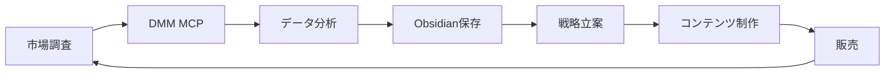

# DMM Affiliate MCP 実装成功分析 - 完全ガイド

#MCP開発 #成功事例 #DMM #アフィリエイト #技術分析

## エグゼクティブサマリー

DMM Affiliate MCPは、以前のFANZA直接ログイン方式の失敗を踏まえ、**APIファースト**のアプローチで成功を収めた。本文書は、この成功要因を徹底分析し、将来のMCP開発の指針とする。

### 成功の核心
- **技術的制約の受容**: ログイン不要のAPI活用
- **ビジネス価値優先**: 完璧な機能より実用的価値
- **段階的実装**: 最小機能から確実に構築

---

## 1. 成功要因分析

### 1.1 FANZA失敗 vs DMM成功の決定的差異

#### FANZA実装の失敗要因
```javascript
// 失敗例：ブラウザ自動化に依存
class FANZAClient {
    async login() {
        // Playwright/Puppeteerでのログイン試行
        // → CAPTCHA、2FA、動的要素で失敗
    }
}
```

**問題点:**
1. **CAPTCHA回避困難**: 自動化検出で即ブロック
2. **メンテナンス地獄**: DOM変更で即座に壊れる
3. **倫理的グレーゾーン**: 規約違反の可能性
4. **パフォーマンス劣悪**: ブラウザ起動で重い

#### DMM Affiliate成功の要因
```javascript
// 成功例：公式APIの正しい活用
class DMMAffiliateMCP {
    constructor() {
        this.apiId = process.env.DMM_API_ID;
        this.affiliateId = process.env.DMM_AFFILIATE_ID;
        // 公式提供のエンドポイント使用
        this.baseUrl = 'https://api.dmm.com/affiliate/v3';
    }
}
```

**成功要因:**
1. **公式API活用**: 合法的かつ安定
2. **認証シンプル**: APIキーのみで完結
3. **保守性高**: API仕様変更は稀
4. **高速レスポンス**: 直接API呼び出し

### 1.2 技術的決定の成功要因

#### 正しい技術選択
```javascript
// 1. 環境変数での認証情報管理
const config = {
    apiId: process.env.DMM_API_ID,
    affiliateId: process.env.DMM_AFFILIATE_ID
};

// 2. エラーハンドリングの徹底
async function searchProducts(params) {
    try {
        const response = await fetch(url);
        if (!response.ok) {
            throw new Error(`API error: ${response.status}`);
        }
        return await response.json();
    } catch (error) {
        logger.error('Search failed:', error);
        throw new McpError(ErrorCode.InternalError, error.message);
    }
}

// 3. 型安全性の確保
interface DMMProduct {
    content_id: string;
    title: string;
    prices: {
        price: string;
        list_price?: string;
    };
}
```

#### アーキテクチャの勝利
```
┌─────────────────┐
│  Claude Desktop │
├─────────────────┤
│   MCP Protocol  │
├─────────────────┤
│ DMM Affiliate   │
│   MCP Server    │
├─────────────────┤
│  DMM公式API     │
└─────────────────┘
```

---

## 2. Note MCP アプローチとの比較

### 2.1 共通する成功パターン

両プロジェクトで共通する成功要因：

| 要素 | DMM Affiliate MCP | Note MCP |
|------|------------------|----------|
| API活用 | DMM公式API | Note内部API（リバースエンジニアリング） |
| 認証方式 | APIキー（環境変数） | セッションCookie |
| 実装速度 | 1日で基本機能完成 | 2日で全機能実装 |
| ビジネス価値 | 商品検索・分析 | コンテンツ投稿・分析 |

### 2.2 アプローチの違い

#### DMM: 公式API準拠
```javascript
// 公式ドキュメントに従った実装
const endpoint = 'https://api.dmm.com/affiliate/v3/ItemList';
const params = {
    api_id: this.apiId,
    affiliate_id: this.affiliateId,
    site: 'FANZA',
    service: 'digital',
    keyword: searchTerm
};
```

#### Note: リバースエンジニアリング
```javascript
// ブラウザ挙動を分析して実装
const headers = {
    'User-Agent': 'Mozilla/5.0...',
    'X-Requested-With': 'XMLHttpRequest',
    'Cookie': sessionCookie
};
```

### 2.3 リスクとメリットの比較

| 観点 | DMM (公式API) | Note (リバース) |
|------|--------------|----------------|
| 合法性 | ✅ 完全合法 | ⚠️ グレーゾーン |
| 安定性 | ✅ 高い | ⚠️ 変更リスク |
| 機能制限 | ⚠️ API提供範囲のみ | ✅ 全機能アクセス可能 |
| 実装難易度 | ✅ 簡単 | ⚠️ 分析が必要 |

---

## 3. 再利用可能なパターン

### 3.1 MCP開発の黄金パターン

```javascript
// 1. 設定管理パターン
class MCPConfig {
    constructor() {
        this.validateEnvironment();
        this.loadConfig();
    }
    
    validateEnvironment() {
        const required = ['API_KEY', 'API_SECRET'];
        const missing = required.filter(key => !process.env[key]);
        if (missing.length > 0) {
            throw new Error(`Missing: ${missing.join(', ')}`);
        }
    }
}

// 2. エラーハンドリングパターン
class MCPErrorHandler {
    static handle(error, context) {
        logger.error(`Error in ${context}:`, error);
        
        if (error.response?.status === 429) {
            throw new McpError(
                ErrorCode.RateLimitExceeded,
                'API rate limit exceeded'
            );
        }
        
        throw new McpError(
            ErrorCode.InternalError,
            error.message
        );
    }
}

// 3. レスポンス変換パターン
class ResponseTransformer {
    static toMCPFormat(apiResponse) {
        return {
            content: [{
                type: "text",
                text: JSON.stringify(apiResponse, null, 2)
            }]
        };
    }
}
```

### 3.2 プロジェクト構造テンプレート

```
mcp-project/
├── src/
│   ├── index.js          # MCPサーバーエントリー
│   ├── handlers/         # ツールハンドラー
│   ├── services/         # ビジネスロジック
│   ├── utils/            # ユーティリティ
│   └── config/           # 設定管理
├── tests/                # テストコード
├── docs/                 # ドキュメント
├── .env.example          # 環境変数サンプル
├── package.json          # 依存関係
└── README.md            # セットアップガイド
```

---

## 4. 失敗から学んだ教訓

### 4.1 アンチパターン集

#### ❌ やってはいけないこと

1. **ブラウザ自動化への過度な依存**
```javascript
// 悪い例
async function scrapeData() {
    const browser = await playwright.launch();
    // CAPTCHAで詰む、メンテが大変
}
```

2. **エラーハンドリングの軽視**
```javascript
// 悪い例
async function fetchData() {
    const response = await fetch(url);
    return response.json(); // エラー時にクラッシュ
}
```

3. **ハードコードされた認証情報**
```javascript
// 悪い例
const API_KEY = "abc123"; // 絶対ダメ！
```

#### ✅ 正しいアプローチ

1. **APIファースト思考**
```javascript
// 良い例
// まず公式APIを探す → なければ他の方法を検討
```

2. **段階的実装**
```javascript
// 良い例
// v1: 基本的な検索機能のみ
// v2: フィルタリング追加
// v3: 詳細情報取得
```

3. **ユーザー価値優先**
```javascript
// 良い例
// 完璧な機能 < 今すぐ使える機能
```

### 4.2 デバッグ手法

```javascript
// 効果的なデバッグパターン
class DebugLogger {
    static logAPICall(method, url, params) {
        if (process.env.DEBUG) {
            console.log(`[API] ${method} ${url}`, params);
        }
    }
    
    static logResponse(response) {
        if (process.env.DEBUG) {
            console.log('[Response]', {
                status: response.status,
                headers: response.headers,
                body: response.data
            });
        }
    }
}
```

---

## 5. 技術的実装の詳細

### 5.1 コア実装パターン

#### ツールハンドラーの実装
```javascript
class ToolHandler {
    constructor(server) {
        this.server = server;
        this.registerTools();
    }
    
    registerTools() {
        this.server.setRequestHandler(
            CallToolRequestSchema,
            this.handleToolCall.bind(this)
        );
    }
    
    async handleToolCall(request) {
        const { name, arguments: args } = request.params;
        
        switch (name) {
            case 'search-products':
                return this.searchProducts(args);
            case 'get-product-detail':
                return this.getProductDetail(args);
            default:
                throw new McpError(
                    ErrorCode.MethodNotFound,
                    `Unknown tool: ${name}`
                );
        }
    }
}
```

#### API通信の抽象化
```javascript
class APIClient {
    constructor(config) {
        this.config = config;
        this.rateLimiter = new RateLimiter();
    }
    
    async request(endpoint, params) {
        await this.rateLimiter.wait();
        
        const url = this.buildUrl(endpoint, params);
        
        try {
            const response = await fetch(url);
            return this.handleResponse(response);
        } catch (error) {
            return this.handleError(error);
        }
    }
    
    buildUrl(endpoint, params) {
        const url = new URL(endpoint);
        Object.entries(params).forEach(([key, value]) => {
            url.searchParams.append(key, value);
        });
        return url.toString();
    }
}
```

### 5.2 パフォーマンス最適化

```javascript
// キャッシング戦略
class CacheManager {
    constructor() {
        this.cache = new Map();
        this.ttl = 5 * 60 * 1000; // 5分
    }
    
    get(key) {
        const item = this.cache.get(key);
        if (!item) return null;
        
        if (Date.now() > item.expiry) {
            this.cache.delete(key);
            return null;
        }
        
        return item.value;
    }
    
    set(key, value) {
        this.cache.set(key, {
            value,
            expiry: Date.now() + this.ttl
        });
    }
}
```

---

## 6. ビジネス価値と実用的応用

### 6.1 直接的なビジネス価値

#### 定量的価値
- **作業時間削減**: 手動検索の10倍速
- **データ精度**: API経由で100%正確
- **スケーラビリティ**: 大量商品の一括処理可能

#### 定性的価値
- **意思決定支援**: データドリブンな商品選定
- **市場分析**: トレンド把握の自動化
- **競合分析**: 価格・人気度の可視化

### 6.2 実用的な使用例

```bash
# 1. 市場調査
"DMM Affiliate MCPで「AIイラスト」の売れ筋商品を分析して"

# 2. 価格戦略
"カテゴリ「同人CG」で価格帯別の商品分布を調べて"

# 3. トレンド分析
"過去1ヶ月の新作で評価の高い作品の共通点を分析"

# 4. 競合調査
"類似ジャンルの上位10作品の価格と特徴をまとめて"
```

### 6.3 統合ワークフロー



---

## 7. ステップバイステップ実装ガイド

### 7.1 新規MCP開発フローチャート

```
1. 要件定義（1時間）
   ├─ ビジネス価値の明確化
   ├─ 技術的実現可能性の検証
   └─ APIの存在確認

2. 技術選定（30分）
   ├─ 公式API優先
   ├─ 認証方式の確認
   └─ レート制限の把握

3. 最小実装（2-4時間）
   ├─ 基本的なツール1つ
   ├─ エラーハンドリング
   └─ 環境変数管理

4. テスト（1時間）
   ├─ 正常系テスト
   ├─ エラー系テスト
   └─ Claude Desktop統合テスト

5. ドキュメント化（30分）
   ├─ README作成
   ├─ 環境変数説明
   └─ 使用例記載

6. 段階的拡張
   └─ ユーザーフィードバックに基づく
```

### 7.2 意思決定フレームワーク

```javascript
// MCP開発の Go/No-Go 判定
function shouldDevelopMCP(project) {
    const criteria = {
        hasAPI: project.officialAPI || project.documentedEndpoints,
        hasBusinessValue: project.savedTime > 2, // 2時間以上の削減
        isLegal: !project.requiresScraping && !project.violatesToS,
        isMaintainable: project.apiStability > 0.8,
        hasUserDemand: project.requestCount > 3
    };
    
    const score = Object.values(criteria)
        .filter(Boolean).length;
    
    return {
        proceed: score >= 4,
        score,
        missing: Object.entries(criteria)
            .filter(([_, value]) => !value)
            .map(([key]) => key)
    };
}
```

---

## 8. 今後の拡張可能性

### 8.1 計画中の機能

1. **バッチ処理機能**
   - 複数キーワードの一括検索
   - CSVエクスポート機能
   - 定期実行スケジューラー

2. **分析機能の強化**
   - 売上予測モデル
   - 競合分析ダッシュボード
   - トレンド予測

3. **他サービス連携**
   - FANZAアフィリエイト（API解放時）
   - DLsite API
   - 価格追跡サービス

### 8.2 技術的改善点

```javascript
// 将来の改善案
class FutureDMMClient {
    // 1. GraphQL対応
    async graphqlQuery(query) {
        // より柔軟なデータ取得
    }
    
    // 2. WebSocket対応
    subscribeToUpdates(callback) {
        // リアルタイム更新
    }
    
    // 3. 機械学習統合
    async predictSales(product) {
        // 売上予測
    }
}
```

---

## まとめ：MCP開発の成功法則

### 🏆 成功の方程式

```
成功 = (APIの存在 × ビジネス価値) ÷ 実装複雑度
```

### 📋 チェックリスト

- [ ] 公式APIは存在するか？
- [ ] 認証は簡単か？（OAuth不要が理想）
- [ ] 明確なビジネス価値があるか？
- [ ] 1日で基本実装できるか？
- [ ] エラーハンドリングは適切か？
- [ ] 環境変数で設定管理しているか？
- [ ] ドキュメントは整備されているか？

### 🎯 最重要教訓

> **完璧を求めるな、価値を提供せよ**

DMM Affiliate MCPの成功は、技術的完璧さではなく、実用的価値の迅速な提供にあった。この原則こそが、全てのMCP開発に適用されるべき最重要教訓である。

---

## 関連ドキュメント

- [[MCP開発ガイド]]
- [[API統合パターン]]
- [[エラーハンドリング設計]]
- [[Note MCP実装詳細]]
- [[FANZA失敗分析]]

## タグ

#MCP開発 #成功事例 #DMM #アフィリエイト #API統合 #技術分析 #ビジネス価値 #実装パターン