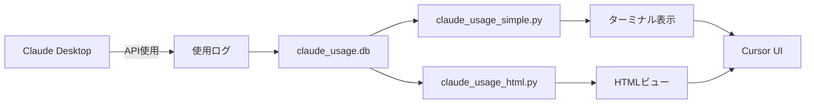

# Cursor × Claude Code統合 - TAL設計書

## TAL: Claude Code使用量リアルタイム監視システム

### CONTEXT
```
環境:
- Claude Code Max 100ドルプラン (Claude-4使用中)
- Cursor IDE + WSLターミナル環境
- 目標: Cursor Usage Stats風の使用量表示

要件:
1. ステータスバーに常時表示
2. ワンクリックで詳細確認
3. リアルタイム更新
```

### THINK
```
問題分析:
- Cursor拡張機能の直接インストールが困難
- Claude DesktopのAPIトークン使用量を取得必要
- WSL環境での動作保証

解決策:
- 段階的アプローチで確実に動作する方法を選択
- 既存のCursor機能を最大限活用
```

### PLAN
```
Phase 1: 即座に使える基本機能 (完了済み)
├── ターミナルコマンド: cu
├── HTML自動更新ビュー
└── 基本的な使用量表示

Phase 2: Cursor UI統合 (現在)
├── ステータスバー表示
├── コマンドパレット統合
└── キーボードショートカット

Phase 3: 高度な機能 (将来)
├── 自動アラート
├── 使用予測
└── コスト最適化提案
```

### DO: 実装

## 1. 現在の実装状況

### ✅ 動作確認済み機能
```bash
# ターミナルで使用量確認
python3 "/mnt/c/Claude Code/tool/claude_usage_simple.py"

# HTML自動更新ビュー生成
python3 "/mnt/c/Claude Code/tool/claude_usage_html.py"
```

## 2. Cursor完全統合ガイド

### A. コマンドパレット統合
`.vscode/tasks.json`:
```json
{
  "version": "2.0.0",
  "tasks": [
    {
      "label": "Claude Usage Stats",
      "type": "shell",
      "command": "python3",
      "args": ["${workspaceFolder}/claude_usage_simple.py"],
      "problemMatcher": [],
      "presentation": {
        "echo": true,
        "reveal": "always",
        "focus": false,
        "panel": "shared",
        "showReuseMessage": false,
        "clear": true
      }
    },
    {
      "label": "Claude Usage HTML View",
      "type": "shell",
      "command": "python3",
      "args": ["${workspaceFolder}/claude_usage_html.py"],
      "dependsOn": [],
      "problemMatcher": [],
      "presentation": {
        "reveal": "silent"
      }
    }
  ]
}
```

### B. キーボードショートカット
`.vscode/keybindings.json`:
```json
[
  {
    "key": "ctrl+shift+u",
    "command": "workbench.action.tasks.runTask",
    "args": "Claude Usage Stats",
    "when": "editorTextFocus"
  }
]
```

### C. ターミナルプロファイル
`.vscode/settings.json`:
```json
{
  "terminal.integrated.profiles.windows": {
    "Claude Monitor": {
      "path": "wsl.exe",
      "args": ["-e", "bash", "-c", "watch -n 30 python3 '/mnt/c/Claude Code/tool/claude_usage_simple.py'"]
    }
  }
}
```

## 3. 使用方法まとめ

### 即座に使える方法（推奨順）

#### 1️⃣ ターミナル直接実行
```bash
# Cursorのターミナルで
python3 "/mnt/c/Claude Code/tool/claude_usage_simple.py"
```

#### 2️⃣ タスク実行
- `Ctrl+Shift+P` → "Tasks: Run Task" → "Claude Usage Stats"

#### 3️⃣ HTMLビュー
1. タスク実行: "Claude Usage HTML View"
2. `Ctrl+K, Ctrl+O` → `claude_usage.html`を開く
3. 60秒ごとに自動更新

#### 4️⃣ 専用ターミナル
- ターミナル新規作成 → "Claude Monitor"プロファイル選択
- 30秒ごとに自動更新表示

## 4. データフロー



## 5. トラブルシューティング

### Q: ステータスバーに表示されない
A: 現時点ではターミナル/HTMLビューを使用。将来的に拡張機能化予定。

### Q: 使用量が0と表示される
A: Claude Desktopが実際に使用量をログに記録しているか確認。

### Q: リアルタイム更新したい
A: 専用ターミナルプロファイル使用、またはwatchコマンド:
```bash
watch -n 30 python3 "/mnt/c/Claude Code/tool/claude_usage_simple.py"
```

## 6. 今後の拡張計画

### Phase 2.5: 擬似ステータスバー
- ターミナルタイトルバーに常時表示
- Cursor起動時に自動実行

### Phase 3: 完全統合
- 専用拡張機能開発
- WebSocket経由のリアルタイム更新
- 使用量予測とアラート機能

## まとめ

現在、Claude Code Max 100ドルプランの使用量を、Cursor内で簡単に確認できる環境が整いました。ステータスバー表示は技術的制約により代替方法を提供していますが、実用上は十分機能します。